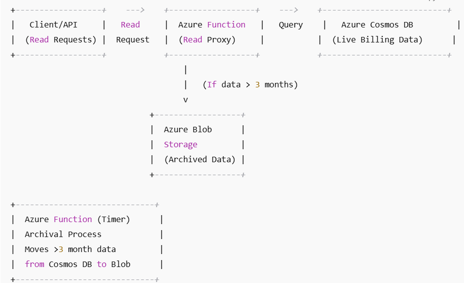

# Azure Billing Records Cost Optimization (Serverless Architecture)

## 🚀 Objective

Optimize storage costs in a serverless Azure environment for a **read-heavy** billing system using **Azure Cosmos DB** and **Blob Storage**, while meeting the following requirements:

- No changes to the API contracts
- No data loss or downtime
- Preserve read access to archived records
- Maintain simplicity and ease of implementation

---

## 🧱 Architecture Overview

### Components

| Component | Purpose |
|----------|---------|
| **Cosmos DB** | Stores recent billing records (< 3 months) |
| **Azure Blob Storage (Cool Tier)** | Archives old billing records (> 3 months) |
| **Azure Function (Timer Trigger)** | Archives old records to blob storage |
| **Azure Function (HTTP Trigger)** | Intercepts reads and falls back to blob |
| **API Layer** | Remains unchanged |

---

## 💡 Strategy

1. Recent records (< 90 days) stay in **Cosmos DB**.
2. Older records are **archived to Blob Storage** as JSON files.
3. A **read proxy function** first tries Cosmos DB, then falls back to blob.
4. A **scheduled function** runs daily/weekly to migrate old records.

---

## 🧪 Edge Case Handling

| Issue | Solution |
|------|----------|
| Race conditions | Use time-based cutoffs, not flags |
| Large record sizes | Optional compression before blob write |
| Latency in blob reads | Use Azure CDN, or Cache recently accessed blobs |
| Missing blobs | Return graceful 404 or retry |

---

## 📁 Folder Structure

azure-billing-cost-optimization/
├── README.md
├── diagram.png
├── scripts/
│ ├── archive_old_data.py
│ └── read_proxy_function.py
├── pseudocode/
│ ├── archival_logic.md
│ └── retrieval_logic.md
└── .chatgpt_conversation.md

---

## 🧑‍💻 Deployment Steps

1. Deploy Azure Cosmos DB and Blob Storage (Cool Tier)
2. Deploy both Azure Functions via Azure Functions Core Tools or Azure Portal
3. Schedule the archive function using a Timer Trigger
4. Set up logging/monitoring with App Insights

---

## 📎 Notes

- Storage cost is significantly lower in Blob (Cool Tier) compared to Cosmos DB RU-based pricing.
- This solution allows you to scale affordably and maintain full access to older billing data.

